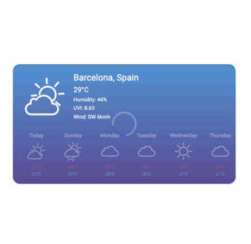

# Vue 3 - Weather Widget

[](https://github.com/ArslanAmeer/weather-widget/actions/workflows/tests.yml) [](https://app.netlify.com/sites/vue-weather-widget/deploys)

Weather Widget is a Vue 3.0 project that displays the current weather conditions providing coordinates.

**_Features:_**

- Beautiful Animation
- Animated Icons on Current weather condition
- Rain effect if current weather is rain

- Current weather status at top:

  - City with Country name
  - Temperature
  - Humidity
  - UVI
  - Wind direction (in text: for example NE, SW, E, etc) and wind
  - Speed in kmh

- Weather Forecast below:

  The bottom part is the forecast for today and the next 5 days, For every single day we show:

  - Week name
  - Weather icon
  - Max temp
  - Min temp

<small>more features are coming soon</small>

><b>NOTE:</b> Animated icons may not work as `object` element which loaded animated SVGs is replaced by `img` tag due to cloudinary svg security

---

# How to use widget in your app

A simple, easy-to-use weather widget for Vue3 applications, showing a week's worth of weather data using the OpenWeatherMap API.

## Installation

Install the package using npm:
  ```console
  npm install vue3-open-weather-widget
  ```

## Usage

Import component and its styles from `vue3-open-weather-widget` inside your vue3 component:
```typescript
<script lang="ts">
  // TS will give you error in importing but it will work as expcted
  import { WeatherWidget} from 'vue3-open-weather-widget'
  import "vue3-open-weather-widget/style.css"
</script>

<template>
  <WeatherWidget :openWeatherApiKey="'<YOUR-OPEN-WEATHER-API-KEY>'"/>
</template>
```
Pass your OpenWeatherMap API key as a prop:
```html
:openWeatherApiKey="<YOUR-OPEN-WEATHER-API-KEY>"
```

Replace yourOpenWeatherApiKey with your actual OpenWeatherMap API key.

    The weather widget should now be displayed in your application, showing the current weather data for the upcoming week.

You can visit stackblitz demo app [HERE](https://stackblitz.com/edit/vue3-weather-widget?file=src%2Fcomponents%2FHelloWorld.vue) to see the usage

## Configuration

The WeatherWidget component accepts the following props:

`openWeatherApiKey` (required): Your OpenWeatherMap API key to fetch weather data.

---

### Demo in Motion: 😉



# **LIVE DEMO. [TRY NOW](https://vue-weather-widget.vercel.app/)** 😍

## 💡**NOTE :**

This Weather Widget is only a demonstration of my work (working with VUE 3) & is not production ready.

---

# Development On Widget

## Understanding:

- Developed using **Vue 3** with:

  - Vue Cli
  - Composition api
  - SFC
  - Typescript
  - Jest (for unit testing)
  - Scss

- Folder Structure:

```console
      ├───src
      │   ├───assets
      │   │   ├───styles
      │   │   │   └───css
      │   │   │       └───(vendor or 3rd party) *.css
      │   │   └───weather-widget-icons
      │   ├───components
      │   │   └─── components *.vue
      │   ├───modals
      │   │   └─── modals *.ts
      │   ├───scss
      │   │   └─── scss_files *.scss
      │   ├───utils
      │   │   └─── utilities *.ts
      │   ├───views
      │   │   └─── views *.vue
      │───tests
          └───unit
              ├───components
              │   └─── *.spec.ts
              ├───utils
              │   └─── *.spec.ts
              └───views
                  └─── *.spec.ts

```

## Guide:

- This project is based on 3 components mainly:

  - `HomePage.vue` : This is the main home page component/view loaded by `app.vue`
  - `WeatherWidget.vue` is the component loaded inside `Homepage.vue` which is basically a complete widget itself (a widget wrapper) which shows the top section of widget displaying current weather condition and animated icons. And the other part is `MiniForecastWidget.vue`.
    - <small>Note: to animate icons we have used https://www.svgator.com/</small>
  - `MiniForecastWidget.vue` is the the component which shown the bottom section of widget contains 6 tiny widgets which shows the weather forecast for next 5 days.

  - We also have utilities function inside `utils` folder. Which are:
    - `countries-list` : This is a list of countries which are used to fetch the country name from the country code.
    - `dynamic-icon` : This is a utility function which is used to dynamically load the weather icon based on the weather condition.
    - `fetch-weather-icon` : This is a utility function which returns path to weather icon fetch by using `dynamic-icon` utility function.
    - `slugify` : This is a utility function which is used to convert the string to slug.
    - `speed-converter` : This is a utility function which is used to convert the speed from m/s to km/h and alternate.
    - `temperature-converter` : This is a utility function which is used to convert the temperature from kelvin to celsius and alternate.
    - `wind-direction` : This is a utility function which is used to convert the wind direction from degrees to text.

## Project setup:

```
npm install
```

### Compiles and hot-reloads for development

```
npm run serve
```

### Compiles and minifies for production

```
npm run build
```

### Run your unit tests

```
npm run test:unit
```

### Lints and fixes files

```
npm run lint
```

### Customize configuration

See [Configuration Reference](https://cli.vuejs.org/config/).


---
# License

MIT